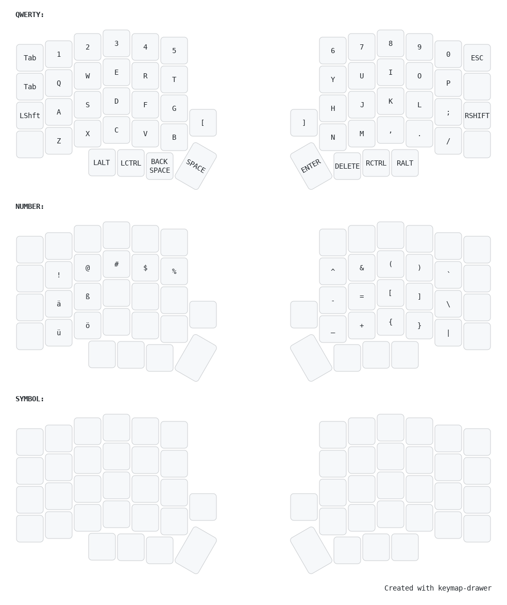

[](https://github.com/darthkali/zmk-config-corne/actions/workflows/build.yml)

# Layout




<sub>_View on [Keyboard Layout Editor](https://www.keyboard-layout-editor.com/#/gists/250c971a1ab733f496a6edca25804e91)_<sub>

I started with an initial layout from the following Repo: https://caksoylar.github.io/keymap-drawer?keymap_yaml=H4sIAAAAAAAC_73Q2U7CQBQG4HueYqxLNFJGcMeYSGsRpCy2RUSs2EqhDbTFUjW4PIs3PoNX3vli9h-iQYKJJsYm87VzZjrnnJklfSMYWC1ieC0S2pZHwlvL6EaBduC7xA7D_iBNaccJ7Wszcem7VC7XKkq5INA7t8tf-l7b6fB3lsenqNnzTeoajkdH4egVeJYzsJvReqJrDV2jH-sZQ_86TMcIuXK7zSho-kbQSpOe0xuub9HAuklijxUMsOeoJilaHV-E8KTBaYbJxQmXBCmwCtbAOtgAm2ALbIMVIKkip5PJc45Aja0DBWigDqogD8qgAjj98wxZtdshYhmggn2QBQcgBw5BAchghyVSc_msNnYWgqfgBIjgGAhcnGtEQ8ekBIogDhKAThaVkVkDsqgpLJ-QEQtErWRE1uHnh1TSJNbuviRL2qj7j18UnKGTsSc2GqVqUZCU9JeqfzzGbh_zGbAHZsEcmAfnYAEsgiVwMdElpm_PzKfJRDzYBQ3Abu7sbFoJb6_Ml-9KboJlcA8ewcOUSr5vOdqm1otCWf6bO_v5f_-b7pdp9dg7-2JHTHYEAAA%3D

# Using German Umlauts in ZMK on macOS

To type German umlauts, I used the following library: [zmk-helpers by urob](https://github.com/urob/zmk-helpers).

On macOS, the following steps were necessary to make this work:

1. **Enable the “Unicode Hex Input” source in macOS**
2. **Set `HOST_OS` to the correct value for macOS**
3. **Include the appropriate Unicode helpers in your ZMK config**

---

## 1. Enable Unicode Hex Input in macOS
- Open **System Settings** (formerly **System Preferences**).
- Go to **Keyboard** -> **Input Sources**.
- Click the **plus (+) icon**.
- Scroll down to **Others** and select **Unicode Hex Input**.
- Add that input source.
- Make sure you can now switch between your normal layout and **Unicode Hex Input** in the macOS menu bar.

> **Tip**: You may want to create a macOS shortcut to quickly switch between input sources.

---

## 2. Set `HOST_OS` in ZMK to `2`
In your keymap file, include the following:

```c
#define HOST_OS 2
``` 
This tells the ZMK helpers that you are using macOS, so they can use the appropriate input logic.
 
# 3. Include the appropriate Unicode helpers
Next, include the helper and the required language file, for example german.dtsi. You might place this at the top of your .keymap file (or wherever you have your includes):

```
#include "zmk-helpers/helper.h"
#include "zmk-helpers/unicode-chars/german.dtsi"
```

This grants you access to the predefined keycodes that german.dtsi provides (e.g., de_ae for “ä”, de_oe for “ö”, and so on).


# Defining Umlauts in your keymap layout
Finally, you just need to assign the respective Unicode keycode to a key press in your layout. In my case, I mapped each umlaut to a double-tap on its base letter (e.g., “ä” on double-tap of “a”, “ü” on double-tap of “u”, etc.).

```
td_uml_a: td_umlaut_a {
  compatible = "zmk,behavior-tap-dance";
  label = "TAP_DANCE_UMLAUT_A";
  #binding-cells = <0>;
  tapping-term-ms = <200>;
  bindings = <&hm LGUI A>, <&kl>;
};
```
